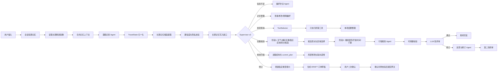

# 一键游 Multi-Agent 原型说明

这份原型用于在 Dify 中展示完整编排，同时作为后续 LangGraph 实现蓝图。Dify 文件是 `oneclick-trip-multi-agent.yml`。

## 核心流程



## Supervisor v2 分流

| 意图 | 路径 |
|---|---|
| `general_qa` | RAG/普通回答，不生成完整行程 |
| `weather_query` | ToolSelector -> weather -> 天气结果整理 |
| `hotel_query` | ToolSelector -> hotel_search -> 酒店结果整理 |
| `transport_query` | ToolSelector -> route/train/flight 中实际需要的工具 -> 交通对比 |
| `trip_plan` | 两阶段研究 -> 完整行程规划 |
| `modify_plan` | 加载 `current_plan` -> 局部修改 -> 新版本 |
| `booking` | 按 `booking_type` 刷新报价 -> 订单草稿 -> 等待确认 |
| `booking_confirm` | 校验草稿和确认令牌 -> 提交网关 |
| `memory_manage` | 长期记忆查询、修改或删除 |

ToolSelector 的输出是 `selected_tools/phase1_tools`。在 LangGraph 中使用条件边处理互斥任务，使用 `Send` 只并行分发选中的工具。

Supervisor 不再使用全局 `ready_for_execution == false` 把所有意图送去追问。每种意图拥有自己的槽位守卫：

- `weather_query`：城市解析顺序为用户明确城市 -> 当前行程目的地 -> 长期画像常用城市 -> 小程序设备当前城市。只有四级来源都不可用时才追问。
- `hotel_query`：允许先按当前城市或目的地返回区域建议，日期缺失不阻塞基础查询。
- `transport_query`：出发地可回退到当前城市，目的地缺失时才追问。
- `general_qa`：直接回答，不检查行程字段。
- `trip_plan`：独立检查目的地、日期/天数、人数和预算。

因此“今天天气怎么样”的路径是：

```text
weather_query -> ToolSelector(weather) -> LocationResolver(DEVICE_CURRENT_CITY) -> weather -> 天气结果整理
```

## 工具依赖

完整规划不能把所有工具放在同一层：

```text
阶段 1：weather + intercity_transport + hotel_area + poi_candidates
  -> candidate_selector 生成 poi_id、visit_date、destinations
阶段 2：route_matrix + opening_hours + ticket_quotes
  -> planner
```

门票查询必须拿到 `poi_id + visit_date`；路线矩阵必须拿到最终候选 `destinations`。阶段 2 缺少这些字段时返回结构化错误，不允许模型补造。

## 两层记忆

### 短期记忆

- 范围：仅当前聊天窗口，对应 `conversation_id/thread_id`。
- 内容：最近 20 轮消息、当前行程槽位、未解决问题、最近一次方案和修改要求。
- Dify 原型：LLM 节点的 `memory.window(size=20)`。
- LangGraph 实现：`checkpointer + thread_id`，可选 Redis 保存活跃会话状态。
- 生命周期：会话关闭或 TTL 到期后清除，不写入永久画像。

### 长期记忆

- 范围：同一用户跨会话使用，对应 `user_id`。
- 内容：稳定的旅行节奏、预算风格、饮食、交通、住宿、活动偏好和明确避雷项。
- 存储：MySQL 业务库保存结构化画像；需要语义召回时，再将记忆摘要写入向量库。
- 不保存：一次性的目的地、日期、人数、本次预算以及身份证、支付信息等敏感数据。
- 更新：用户明确表达或同一偏好多次出现才允许写入；每条记忆保存证据、置信度和更新时间。

## 记忆规则

1. 当前用户明确要求始终高于历史偏好，例如长期喜欢慢游，但本轮说“这次赶行程”，按本轮执行。
2. “这次住五星酒店”是短期条件；“我旅行通常住经济型酒店”才是长期候选。
3. 明确表达的长期偏好置信度达到 `0.85` 才可自动写入；模型推测不得直接落库。
4. 用户可以说“查看我的旅行偏好”“忘掉我喜欢早起”“以后优先高铁”来查询、删除或覆盖记忆。
5. 写入和删除必须记录 `evidence/source/confidence/updated_at`，以便解释与审计。

## TravelState

LangGraph 建议使用 `TypedDict` 或 Pydantic 模型保存：

```text
query
user_id
thread_id
intent
confidence
ready_for_execution
missing_fields
entities
preference_tags
short_term_summary
long_term_profile
memory_candidates
memory_operations
memory_write_status
requested_tools
booking_type
tool_results
tool_errors
current_plan
current_plan_id
plan_version
selected_option_ids
quote_ids
validation_errors
booking_draft
revision_count
final_answer
```

Dify 对对象变量有最大嵌套深度限制。意图、槽位和路由状态使用浅层 `state/state_patch` 对象；天气详情、工具结果、候选景点、行程、报价和订单草稿等深层数据使用 `*_json` 字符串跨节点传递，在 Code 节点边界解析。当前剩余对象输出最大深度为 3，不超过 Dify 的 5 层限制。

这只是 Dify 演示适配层。LangGraph 实现继续使用真正的 Pydantic/TypedDict 结构化 State，不照搬 JSON 字符串传输方式。

## Agent 与 LangGraph 映射

| Dify 节点 | LangGraph 节点 | 职责 |
|---|---|---|
| 会话短期记忆 | `load_thread_memory` | 读取当前对话状态和消息窗口 |
| 长期旅游画像读取 | `load_user_profile` | 按 `user_id` 读取稳定偏好 |
| 上下文合并 | `merge_memory_context` | 合并当前需求、短期状态与长期画像 |
| 意图识别与槽位抽取 | `understand_request` | 意图、实体、工具需求和画像标签 |
| 长期记忆候选提取 | `extract_memory_candidates` | 从明确表达中找稳定偏好 |
| 写入策略与隐私校验 | `validate_memory_update` | 过滤一次性需求、低置信度和敏感信息 |
| 长期记忆写入 | `persist_user_profile` | 执行 upsert/delete 并保留证据 |
| 偏好补全与追问 | `clarify_requirements` | 缺失信息追问与多轮状态更新 |
| ToolSelector | `select_tools` | 按意图选择工具并生成分阶段执行计划 |
| 候选检索 | `phase1_research` | 天气、城际交通、酒店区域和景点候选 |
| 候选选择 | `select_candidates` | 生成 `poi_id`、日期和路线目的地 |
| 精查 | `phase2_research` | 路线矩阵、开放时间和门票余量 |
| 行程规划协调器 | `build_itinerary` | 合并两阶段结果并生成结构化方案 |
| 代码硬校验 | `validate_plan_rules` | 天数、住宿晚数、预算、时间窗和必要 ID |
| LLM 软评审 | `review_trip_quality` | 节奏、体验、偏好匹配和表达质量 |
| 反思与行程修订 | `revise_itinerary` | 按问题列表局部修订 |
| 预订协调与确认 | `prepare_booking_draft` | 仅为 `booking_type` 指定项目生成草稿 |

## 记忆接口

| 接口 | 作用 |
|---|---|
| `GET /tools/memory/profile/{user_id}` | 读取长期旅游画像 |
| `POST /tools/memory/profile/upsert` | 新增或更新稳定偏好 |
| `DELETE /tools/memory/profile/item/{memory_id}` | 删除指定偏好 |
| `GET /tools/memory/profile/{user_id}/audit` | 查看记忆来源和更新时间 |

建议 MySQL 表 `user_travel_memory` 包含：`id`、`user_id`、`category`、`memory_key`、`memory_value`、`confidence`、`evidence`、`source`、`created_at`、`updated_at`、`deleted`。

## 旅游工具接口

| 工具 | 预留接口 |
|---|---|
| 天气 | `GET /tools/weather` |
| 路线 | `POST /tools/routes/plan` |
| 酒店查询 | `POST /tools/hotels/search` |
| 火车查询 | `POST /tools/trains/search` |
| 飞机查询 | `POST /tools/flights/search` |
| 多知识库 RAG | `POST /tools/knowledge/retrieve` |
| 门票查询 | `POST /tools/tickets/search` |
| 刷新预订报价 | `POST /tools/bookings/quotes/refresh` |
| 生成订单草稿 | `POST /bookings/drafts` |
| 确认后提交 | `POST /bookings/submit` |

当前 Dify 演示 DSL 使用统一的结构化 Mock 数据，不调用任何外部接口。天气、酒店、交通、景点、路线、门票、记忆写入和预订结果均带有 `data_mode=MOCK` 标识。

项目中的 FastAPI 天气服务已经接入 Open-Meteo，但暂时与 Dify 演示图解耦。后续切换真实模式时，将 Mock Executor 替换为 HTTP Request/Tool 节点即可，Supervisor、ToolSelector、两阶段研究和校验链路不需要重写。

`/bookings/submit` 必须校验用户身份、`draft_id`、最新 `quote_id`、过期时间和一次性确认令牌。搜索、报价和草稿阶段都不得调用有副作用的第三方下单接口。

## 循环策略

Dify 原型采用“自检 -> 条件分支 -> 修订 -> 第二轮终审”的有界两轮方式。LangGraph 可改成条件回边：

```text
validate_itinerary
  pass   -> finalize_itinerary
  revise -> revise_itinerary -> validate_itinerary
  revision_count >= 2 -> finalize_itinerary
```

记忆更新不放入规划自检循环，避免同一句话被重复写入；使用 `user_id + category + key + evidence_hash` 做幂等控制。

## 服务边界

- FastAPI + LangGraph：意图识别、RAG、工具编排、短期状态、记忆候选、自检和修订。
- Spring Boot：用户身份、长期画像持久化、行程、订单、权限、确认令牌和第三方预订适配。
- Vue：流式进度、工具状态、行程卡片、对话修改、记忆管理和预订确认。
- Dify Code 节点仅展示接口契约，不包含真实密钥，不会产生真实订单或永久修改用户画像。
