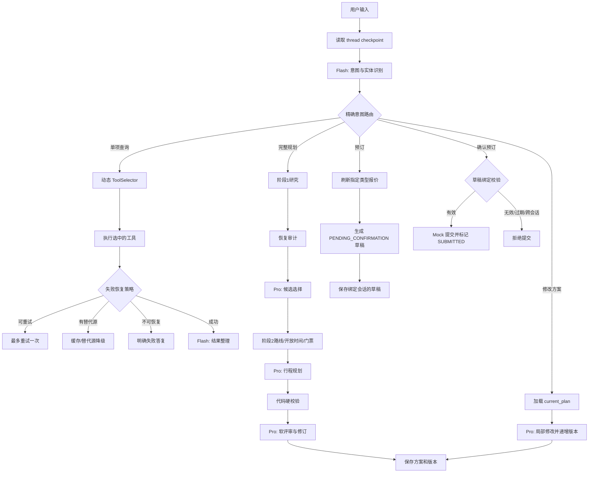

# 一键游 Multi-Agent v3 架构

v3 在已跑通的 v2 主链路上补齐三个生产化缺口：跨轮状态、预订草稿绑定、工具失败恢复；同时增加 Flash/Pro 模型分层。

## 总体链路



## 1. 跨轮状态

Dify 演示版使用以下 Conversation Variables：

| 变量 | 作用 |
| --- | --- |
| `travel_checkpoint_json` | 当前会话的轻量检查点 |
| `current_plan_json` | 当前结构化行程及版本 |
| `booking_draft_json` | 上一轮待确认或已提交草稿 |
| `checkpoint_version` | 状态版本，用于并发控制 |
| `last_tool_errors_json` | 最近一次工具失败记录 |

每轮开始由 `checkpoint_hydrator` 恢复上下文；方案生成、方案修改、草稿生成和提交完成后，分别通过 Assigner 写回会话变量。深层对象继续使用 JSON 字符串传递，避免 Dify 的对象深度限制。

正式 LangGraph 不应依赖 Dify 变量，应以 `conversation_id` 作为 `thread_id`，使用 Checkpointer 或 MySQL Repository 持久化：

```text
agent_checkpoint(thread_id, checkpoint_version, state_json, updated_at)
travel_plan(plan_id, user_id, thread_id, plan_version, plan_json, status)
booking_draft(draft_id, user_id, thread_id, plan_id, plan_version,
              status, expires_at, quote_snapshot_json, idempotency_key)
```

状态更新使用乐观锁：`UPDATE ... WHERE thread_id=? AND checkpoint_version=?`。冲突时重新读取状态，不覆盖另一轮已保存的数据。

## 2. 预订确认绑定

草稿状态机：

```text
DRAFT -> PENDING_CONFIRMATION -> SUBMITTED
                          \----> EXPIRED / CANCELLED
```

提交前必须同时满足：

1. `draft.thread_id == 当前 conversation_id`。
2. `draft.status == PENDING_CONFIRMATION`。
3. `expires_at` 未过期。
4. 用户本轮包含明确确认语句。
5. 草稿绑定的 `plan_id + plan_version` 仍有效。

真实提交接口还应要求 `idempotency_key=draft_id`，并在数据库事务中把状态从 `PENDING_CONFIRMATION` 原子更新为 `SUBMITTED`。这样重复点击只返回同一订单结果，不会重复下单。

## 3. 工具失败恢复

| 场景 | 动作 | 限制 |
| --- | --- | --- |
| 超时、临时限流 | `retry` | 最多一次，第二次失败停止循环 |
| 实时源不可用但有缓存/替代源 | `fallback` | 必须展示数据来源和时效 |
| 鉴权失败、参数错误且无替代源 | `degraded` | 明确告知不可用，不伪造实时结果 |
| 部分非关键工具失败 | 继续规划 | 在结果中标出缺失项和可信度 |
| 关键工具失败 | 中止相关动作 | 不进入预订或强依赖实时数据的步骤 |

所有工具统一返回 `status`、`data_mode`、`data` 和 `error` 信封。错误写入 `last_tool_errors_json`，后续 LangGraph 节点可据此恢复，而不是依赖 LLM 猜测失败原因。

## 4. Flash / Pro 分层

| 模型 | 任务 |
| --- | --- |
| DeepSeek V4 Flash | 意图识别、偏好候选提取、普通追问、记忆管理、单项查询整理、预订确认说明 |
| DeepSeek V4 Pro | 候选选择、完整行程规划、软评审、反思修订、复杂方案修改、最终终审 |

代码硬校验不调用模型。后续可增加统一 `ModelGateway`：Flash 输出 JSON 解析失败、置信度低于阈值或问题复杂度过高时，仅升级当前节点到 Pro，不让整条链路都使用 Pro。

## 文件

- `oneclick-trip-multi-agent-v3.yml`：Dify 导入文件。
- `build_v3_dsl.py`：从已验证 v2 构建 v3。
- `validate_v3_dsl.py`：图结构与关键状态测试。
- `TEST_CASES_V3.md`：演示测试清单。
