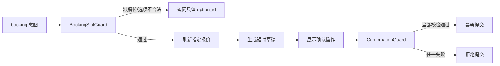

# 一键游 Multi-Agent v4 安全架构

v4 保留 v3 的跨轮状态、动态工具、两阶段研究、模型分层和失败恢复，并补齐方案写入与预订链路的安全边界。

## 审查项落实

| 问题 | v4 处理 |
| --- | --- |
| 软评审可能放过硬错误 | `quality_router_v2` 改为 `hard_pass == true AND verdict == pass` |
| 二次修订仍可能保存坏方案 | 新增 `second_validation_router`；失败直接答复，不进入 Checkpoint Builder |
| 修改失败仍覆盖旧方案 | 新增 `modify_validation_router`；失败保留旧方案 |
| 新方案后旧草稿仍可确认 | 三个方案 Assigner 同时把 `booking_draft_json` 写为 `{}` |
| 草稿只绑定会话 | 草稿增加 UUID、用户、方案版本、随机令牌、SHA-256 哈希和幂等键 |
| booking 缺少槽位守卫 | 新增 `booking_slot_guard -> booking_readiness_router` |
| LLM 可注入未知工具 | `tool_selector` 使用按意图划分的代码白名单，并输出 `ignored_tools` 审计 |
| 恢复结果未写入最终 State | `phase1_recovery_audit` 输出 `recovered_state_patch_json`，Reducer 改读该补丁 |
| 仅开始日期也能规划 | 规划要求 `days` 或 `start_date + end_date` |
| 预算语义模糊 | 增加 `budget_scope=total|per_person` 和 `currency=CNY`；硬校验按人数换算 |
| 没有当前方案却自动造 Mock | `current_plan_loader` 空值返回 `{}`，存在性守卫失败后直接提示先生成方案 |

## 方案写入不变量

```text
NormalPlanSave  = hard_pass AND soft_pass
RevisedPlanSave = second_hard_pass
ModifiedSave    = modify_hard_pass

任何 false 分支都不能到达 Checkpoint Builder。
```

保存新方案、修订方案或修改方案时，必须在同一状态更新中完成：

```text
current_plan_json = validated_plan
checkpoint_version += 1
booking_draft_json = {}
booking_draft_id = null
booking_draft_status = null
```

正式 MySQL 实现应放进同一事务，并通过 `checkpoint_version` 乐观锁防止并发覆盖。

## 预订链路



确认守卫检查：

1. `creator_user_id`、`thread_id`、`draft_id`。
2. `status == PENDING_CONFIRMATION` 且未过期。
3. 草稿与当前 `plan_id + plan_version` 一致。
4. `quote_ids + total_price + selected_option_ids + expires_at` 的哈希未被篡改。
5. 用户提交正确的 `confirmation_token`。
6. 提交使用 `idempotency_key`，成功后草稿变为 `SUBMITTED`。

Dify 聊天演示会把确认令牌显示在确认文本中。正式小程序应由“确认预订”按钮携带令牌，不要求用户手工输入；令牌仅通过 HTTPS 传输并由 Java 后端验证。

## 工具与恢复状态

LLM 只能建议工具，代码白名单拥有最终决定权。未知工具被放入 `ignored_tools`，不会进入执行器。

阶段 1 恢复后的工具结果与恢复轨迹一起写入 `recovered_state_patch_json`。候选选择和 Planner 因此读取同一份状态，不会出现一个节点看到重试成功、另一个节点仍看到失败的情况。

## 文件

- `oneclick-trip-multi-agent-v4.yml`：Dify 导入文件。
- `build_v4_dsl.py`：在 v3 基础上生成 v4。
- `validate_v4_dsl.py`：安全边界与负向测试。
- `TEST_CASES_V4.md`：Dify 手工链路测试。
