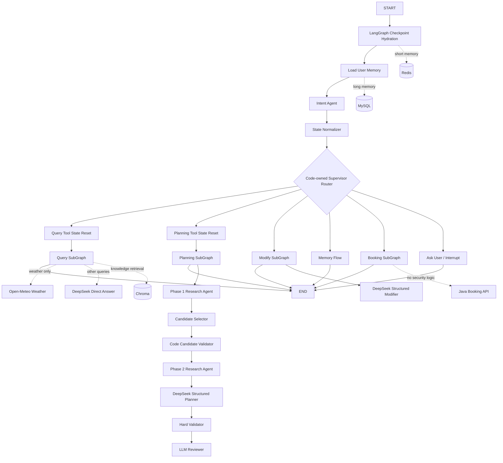

# OneClick Trip Agent

基于 LangGraph 的“旅游一条龙”Agent。当前已完成 B-01 工具平台、B-02 知识管道和 B-03 Java 安全持久化主链路。

## 当前数据策略

- 正式 FastAPI 应用使用 Open-Meteo 查询真实天气，使用 Nominatim 验证景点坐标，再由 OSRM 查询真实景点路线；结果统一记录来源、数据模式、抓取时间和置信度。
- Agent Reach 与小红书采集器不进入用户请求，仅保留在 B-02 管理端离线知识采集注册表。
- 完整规划恢复 Dify V3 的两阶段结构：DeepSeek 宽搜候选，代码校验候选来源，再由 DeepSeek 精查路线、开放时间与门票参考。
- 酒店建议、交通建议、景点、美食和方案修改不调用 Mock 研究工具；模型知识与实时接口数据在 State 中明确区分。
- 模型生成内容属于 AI 通用知识建议，不冒充实时搜索结果；价格、班次、营业时间、余量等必须在接入真实供应商后再确认。
- 酒店、火车、飞机和门票已经定义可替换 Provider 契约，但未配置真实供应商前不会返回伪造库存或价格。预订仍不执行真实交易，但草稿、确认 token hash、方案绑定和幂等状态已经由 Java 后端负责。
- 直接构建测试图时仍可注入 Mock Registry；正式 `create_app()` 默认装配真实 Provider Registry。

## V3 原型业务总结

已读取的 Dify V3 原型包含 74 个节点和 74 条边，核心业务可以归并为：

1. 入口层：短期会话、长期偏好、意图识别、状态归一化。
2. 单项查询：天气走演示接口，其余问题由模型直接回答。
3. 完整规划：阶段一宽搜、候选筛选与代码校验、阶段二精查、结构化规划、代码硬校验、模型软评审和最多两轮修订。
4. 方案修改：加载结构化方案、模型直接修改、校验、保存新版本。
5. 预订协作：收集预订槽位、调用后端草稿接口、人工确认、查询提交状态。
6. 横切能力：Checkpoint、20 轮短期上下文、长期偏好候选提取、隐私门禁、工具错误恢复、Flash/Pro 模型分层。

LangGraph 实现不会保留 Dify 的 Assigner、节点坐标和 JSON 字符串套 JSON。业务被重新组织为一个根图和四个可独立测试的 SubGraph。

## 目标架构



根图只负责共享入口和代码路由。Query、Planning、Modify、Booking 作为静态可发现的 SubGraph 接入，继承父图 Checkpointer。重要业务分流仍由代码决定；LLM 负责意图、普通咨询和结构化方案生成，不能自行绕过天气与预订接口边界。

## Phase 8 实际流程

```text
START
  -> load_conversation_state
  -> load_user_memory
  -> recognize_intent
  -> normalize_state
  -> supervisor
       -> ask_user
       -> query_entry -> query_subgraph
       -> planning_entry -> planning_subgraph
       -> modify_entry -> modify_subgraph
       -> memory_entry
       -> booking_entry -> booking_subgraph
       -> abort / complete
```

`query_subgraph` 内部流程：

```text
select_query_tools
  -> Send(execute_query_tool) 动态并行
  -> ToolExecutor + ToolErrorHandler
  -> format_query_result
```

`planning_subgraph` 内部流程：

```text
phase1_research
  -> Open-Meteo + DeepSeek 候选宽搜
  -> Nominatim 候选景点坐标验证
  -> budget_feasibility
  -> candidate_selection
  -> candidate_validation
       -> invalid: planning_failure
       -> valid: phase2_research
  -> DeepSeek 路线、开放时间、门票参考精查
  -> planner
  -> hard_validation
  -> review_plan
       -> hard_pass && review_pass: save_validated_plan
       -> revision_count < 2: revise_plan -> hard_validation
       -> revisions exhausted: validation_failure
```

`modify_subgraph` 内部流程：

```text
load current_plan
  -> analyze_modification
  -> direct_modify_agent
       -> preserve unaffected days
       -> apply the requested change with AI knowledge
       -> produce version + 1 full draft
  -> hard_validation
  -> review_plan
       -> pass: save_modified_plan
       -> revise: bounded revision loop
       -> fail: keep previous current_plan
```

`booking_subgraph` 内部流程：

```text
booking_slot_guard
  -> verify selected IDs belong to current_plan
  -> Java Backend Mock: create_booking_draft
  -> interrupt(booking confirmation payload)
       -> confirm: Java Backend Mock confirm_booking
       -> reject: Java Backend Mock cancel_booking
  -> update public draft status
```

草稿创建与 `interrupt()` 位于不同节点，因此恢复执行不会重复创建草稿。确认时再次校验 `user_id`、`conversation_id`、`plan_id` 和 `plan_version`；草稿过期、方案版本变化或选项不属于当前方案时均不会提交。LangGraph State 和中断载荷不包含 token、hash、支付信息或供应商订单号。

默认使用可测试的 `RuleBasedIntentAgent`；正式模型通过 `LangChainIntentAgent` 注入，并使用 Pydantic structured output。输出同时包含主意图和最多 8 个 `IntentTask`。天气、酒店、交通和普通问答可以拆成任务级查询并通过 `Send` 并行执行；完整规划会吸收这些研究需求，修改、记忆和预订仍保持单一受控主流程。模型返回 `unknown` 或漏掉明显复合查询时由代码规则修复。缺失槽位、流程路由和工具白名单均由代码决定。Query、Planning、Modify 与 Booking 均为编译后的 SubGraph。

项目保留 `weather`、`hotel_search`、`train_search`、`flight_search`、`poi_search`、`poi_coordinates`、`route_matrix`、`opening_hours`、`ticket` 的统一 `ToolResult` 契约。当前用户运行时启用 Open-Meteo、Nominatim 和 OSRM；其余阶段由模型生成 `AI_KNOWLEDGE` 研究数据，绝不标记为实时价格、班次或余量，以后可逐项替换为合规 Provider。

`ToolErrorHandler` 支持 `retry/fallback/continue/abort`。可重试错误最多额外执行一次。当前天气接口失败时可降级；研究 Agent 失败时由规则研究器生成明确标记为 `OFFLINE_FALLBACK` 的保守候选，仍需经过候选校验和最终质量门禁。

`HardValidator` 使用代码检查天数、住宿晚数、预算、时间冲突、开放时间和路线合理性。`ReviewerAgent` 只评价偏好匹配、节奏和体验。保存条件由代码固定为 `hard_pass == true AND verdict == pass`，不能依赖模型自行遵守 Prompt。

修订最多执行两次。最终仍失败时清除无效 `plan_draft`，保留上一版 `current_plan/plan_version`；生成新有效版本时同步清除旧 `booking_draft`，防止旧方案订单草稿继续使用。

Phase 8 将有效方案保存为 `PersistedPlanState`，其中包含 `TravelPlan`、预算/日期实体、候选选择、两阶段研究结果和可预订 option ID。即使 Redis Checkpoint 过期，修改与预订流程也能从 MySQL 恢复完整业务状态。每轮归一化后都会运行长期记忆候选 Agent；只有跨旅行仍有价值、非敏感且置信度不低于 `0.85` 的稳定习惯才写入 MySQL，一次性目的地、人数和本次预算不会进入长期画像。

## Shared State

`TravelState` 使用 `TypedDict`，复杂值使用 Pydantic 模型：

| 字段 | 类型/职责 |
| --- | --- |
| `conversation_id`, `user_id` | 会话和用户身份引用 |
| `messages` | `AnyMessage` 列表，使用 LangGraph `add_messages` reducer |
| `intent` | 严格 `Intent` 枚举 |
| `intent_confidence` | IntentAgent 置信度，仅用于观测，不直接控制路由 |
| `intent_tasks` | 本轮可独立回答的结构化子任务，各自保存问题片段、意图和实体 |
| `entities` | `TravelEntities`，包含日期、人数、预算范围和币种 |
| `user_preferences` | MySQL 长期偏好快照 |
| `effective_preferences` | 本轮明确需求覆盖长期偏好后的运行时画像 |
| `memory_errors` | 长期偏好读取或保存的错误码 |
| `memory_candidates` | Flash Agent 从本轮对话提取的长期记忆候选 |
| `memory_operations` | 通过类别、隐私与 `0.85` 置信度门禁的写入/删除操作 |
| `current_plan`, `plan_version` | 当前有效结构化方案与业务版本 |
| `plan_draft` | 新规划或修改生成、但尚未通过校验的方案草稿 |
| `phase1_research` | 天气、交通、住宿区域、景点候选的宽搜结果 |
| `candidate_selection` | Pro CandidateSelectorAgent 选择的 ID、访问日、预计时长与路线目的地 |
| `candidate_validation_errors` | 代码检查发现的候选来源错误 |
| `phase2_research` | 路线、开放时间、门票等依赖候选的精查结果 |
| `planning_errors` | Planning SubGraph 的结构化错误码 |
| `hard_validation` | 硬校验结果、错误和警告 |
| `review_result` | ReviewerAgent 的 verdict、评分和建议 |
| `plan_saved` | 本轮草稿是否已提升为正式有效方案 |
| `validation_exhausted` | 两轮修订后是否仍未通过 |
| `modify_analysis` | 修改目标、影响类型、发现工具和依赖工具 |
| `modification_errors` | 目标日、替换景点、预算等修改错误 |
| `selected_options` | 景点、酒店、交通、门票 option ID |
| `selected_tools` | 本轮通过代码白名单选择并执行过的工具 |
| `pending_tools`, `active_tool` | `Send` 动态分发使用的瞬时字段 |
| `tool_results` | `ToolResult` 映射，支持并行结果合并 reducer |
| `query_task_results` | 按 `task_id -> tool_name` 隔离的查询结果，避免多城市并行查询串数据 |
| `tool_errors` | 结构化错误列表 |
| `tool_attempts` | 每个工具本轮实际调用次数，最大为 2 |
| `tool_abort_requested` | 必要工具失败后的代码中止标记 |
| `booking_draft` | Java 后端返回的草稿引用，不包含 token/hash |
| `booking_errors` | 槽位、绑定、过期和后端调用错误码 |
| `booking_confirmation` | Human Interrupt 恢复后的明确确认或取消选择 |
| `booking_interrupted` | 是否正在等待人工确认 |
| `booking_completed` | 后端 Mock 是否已确认草稿 |
| `revision_count` | 最多两轮修订的计数器 |
| `next_action` | Supervisor 的代码路由目标 |
| `checkpoint_version` | 应用层状态版本；不同于 LangGraph 内部 checkpoint ID |

所有节点遵守：`TravelState -> TravelStatePatch`。节点之间不直接调用，通信只经过 State。

## 职责边界

| 组件 | 职责 |
| --- | --- |
| IntentAgent | 已实现：主意图、复合只读子任务与实体抽取，并用代码守卫修复 `unknown`，不直接调用工具或决定图节点 |
| MemoryCandidateAgent | 已实现：按 Dify V3 Prompt 提取稳定习惯，经代码隐私/置信度门禁后写入 MySQL |
| Supervisor | 已实现：根据 Intent、代码槽位守卫和固定映射进行条件路由 |
| Phase1ResearchAgent | 已实现：生成天气上下文、住宿区域、交通方式和景点候选宽搜结果 |
| CandidateSelectorAgent | 已实现：从阶段一候选集合中选择组合，不允许新增 ID |
| Phase2ResearchAgent | 已实现：只对已验证候选整理路线、开放时间和门票参考 |
| PlannerAgent | 已实现：基于两阶段研究生成结构化 `TravelPlan` |
| HardValidator | 已实现：代码检查预算、时间、住宿晚数、开放时间和路线 |
| ReviewerAgent | 已实现：评价偏好匹配、节奏和体验；支持 LangChain structured output |
| RevisionAgent | 已实现：根据校验反馈修订时间、住宿晚数和可削减票价项目，最多两轮 |
| ModifyAnalyzerAgent | 已实现：提取目标日、时段、替换景点、预算变化、删除标签和交换日期 |
| ModifyAgent | 已实现：复制当前方案、应用修改、刷新工具结果并生成 `version + 1` 草稿 |
| ToolSelector | 已实现：每个查询子任务独立执行代码白名单，未知或越权工具不会执行 |
| ToolRegistry | 已实现：注册 Mock/真实 Provider 适配器，并区分实时能力；不允许 Agent 直接调用任意函数 |
| ToolExecutor | 已实现：统一执行、异常封装、尝试次数和错误记录 |
| ToolErrorHandler | 已实现：最多一次重试，并执行 fallback/continue/abort 策略 |
| OpenMeteoWeatherProvider | 已实现：地点解析、当前天气与逐日预报；无需密钥 |
| OsrmRouteProvider | 已实现：仅使用候选景点中的可信经纬度查询真实距离和通行时间 |
| Supplier Provider Contracts | 已实现：酒店、火车、飞机、门票请求契约；待接入合规供应商 API |
| Booking Slot Guard | 已实现：校验预订类型、方案版本及 option ID 是否属于当前方案 |
| BookingBackend | 已实现 Mock 契约：创建、确认、取消草稿；生产环境由 Java API 适配器实现 |
| MySQLRepositories | 已实现：长期偏好、不可变方案版本和当前版本原子切换 |
| PlainRedisSaver | 已实现：兼容普通 Redis 6+，保存短期状态和 Human Interrupt |
| ChromaTravelKnowledgeBase | 已实现：按知识库隔离 Collection、持久化文档和元数据检索 |
| Java Backend | 用户认证、订单草稿、安全 token/hash、幂等提交、支付和供应商接口 |

模型参数按 Dify V3 对齐：所有模型 `temperature=0.1`；意图识别、追问、记忆提取、单项查询使用 Flash，候选选择、阶段二研究、完整规划、软评审和修订使用 Pro。追问、单项查询和修改流程均携带最近 20 轮对话。

## Checkpoint 与 Memory

- 单元测试使用 `InMemorySaver`；本机运行使用 Redis，以 `conversation_id` 作为 `thread_id`。
- 本机普通 Redis 没有 RedisJSON/RediSearch，因此使用 `PlainRedisSaver`；默认保留 24 小时，并在读取会话时刷新 TTL。部署 Redis Stack 后可切换官方 `langgraph-checkpoint-redis`。
- 长期偏好和 `PersistedPlanState` 版本存 MySQL，不把 Redis 当作永久业务数据库。
- 当前明确需求覆盖长期偏好；该合并规则在 Phase 2 的 State Normalizer 中实现。
- Human-in-the-loop 在 Booking Phase 使用 LangGraph `interrupt()`；恢复时继续使用同一个 `thread_id`。
- Checkpoint 反序列化只允许 `app.domain.models` 中显式登记的类型，不开放任意 Python 类型。

MySQL 自动创建 `ai_user_travel_preferences` 和 `ai_travel_plan_versions`。Chroma 默认写入 `.data/chroma`，并按 `poi`、`food` 等知识库创建隔离 Collection。当前离线 Hash Embedding 只用于架构演示；生产检索需替换为 `bge-small-zh-v1.5`，并根据模型版本和向量维度重建索引。

## 目录

```text
travel_agent/
├── app/
│   ├── agents/
│   ├── api/
│   ├── booking/
│   ├── database/
│   ├── domain/
│   ├── graph/
│   │   ├── nodes/
│   │   ├── subgraphs/
│   │   ├── builder.py
│   │   ├── router.py
│   │   ├── state.py
│   │   └── supervisor.py
│   ├── memory/
│   ├── tools/
│   ├── validators/
│   ├── vectorstore/
│   └── main.py
├── scripts/
├── tests/
├── .env.example
├── pyproject.toml
├── uv.lock
└── README.md
```

## 运行

建议 Python 3.13；本机 Phase 8 已在 Python 3.14.4、MySQL 8.0.42、Redis 6.2.16 和 Chroma 1.5.9 验证。

```powershell
cd "F:\CodeProjects\projects\oneclick-trip\ai\travel_agent"
uv venv --python 3.13 .venv
uv sync --extra dev
.\.venv\Scripts\python.exe scripts\bootstrap_infrastructure.py
.\.venv\Scripts\python.exe -m pytest
.\.venv\Scripts\python.exe -m uvicorn app.main:app --host 127.0.0.1 --port 8000
```

仓库根目录的 `tools\start-oneclick-trip.ps1` 会优先启动 Redis Windows 服务；若没有服务，则会自动使用 `F:\DevTools\Redis\redis-server.exe` 并启用 AOF 持久化。相关配置：

```dotenv
REDIS_URL=redis://127.0.0.1:6379/0
CHECKPOINT_TTL_MINUTES=1440
CHECKPOINT_REFRESH_ON_READ=true
```

接口：

```text
GET  /health
GET  /health/infrastructure
POST /v1/agent/runs
POST /v1/agent/runs/resume
GET  /docs
```

Phase 8 首轮规划请求示例：

```json
{
  "conversation_id": "conversation-001",
  "user_id": "user-001",
  "message": "帮我规划成都三日游，两个人，总预算5000，喜欢美食，不要购物"
```

通过双重校验后，`plan_draft` 会提升为 `current_plan`，递增 `plan_version`，并原子写入 MySQL。失败方案不会成为后续修改和预订的依据。

同一 `conversation_id` 的下一轮可以发送：

```json
{
  "conversation_id": "conversation-001",
  "user_id": "user-001",
  "message": "把第二天上午换成熊猫基地"
}
```

当前修改流程由模型基于已保存的结构化方案生成完整新版本，不调用 Mock 研究工具；营业时间、路线和费用仍明确为 AI 估算。没有 `current_plan` 时返回追问，不会制造默认方案。

预订请求必须显式携带当前方案中的 option ID，例如：

```json
{
  "conversation_id": "conversation-001",
  "user_id": "user-001",
  "message": "预订酒店 AREA-KUANZHAI"
}
```

响应中 `interrupted=true` 时，前端显示 `interrupt_payload`，用户确认后使用相同会话恢复：

```json
POST /v1/agent/runs/resume
{
  "conversation_id": "conversation-001",
  "user_id": "user-001",
  "confirmed": true
}
```

存在待确认中断时，普通 `/runs` 返回 `409`，避免绕过确认节点改变当前方案。真实系统还必须由 Java 根据登录态校验 token/hash、报价、幂等键和支付状态。

## 基础设施边界

1. Redis：本机使用普通 Redis 兼容 Saver；生产可换 Redis Stack 官方 Saver，图节点无需修改。
2. MySQL：已实现 `UserPreferenceRepository` 和 `PlanRepository`，只保存通过校验的不可变版本。
3. Vector DB：Chroma 已持久化和隔离知识库；下一步把景点知识检索切换到 RAG Retriever，并接入 BGE Embedding。
4. 外部 API：Open-Meteo 与 OSRM 已接入；后续通过现有 Provider 契约接入酒店、火车、飞机和门票供应商。当前已包含超时、一次重试、降级、来源和抓取时间。
5. Java Booking API：LangGraph 只传选项和方案引用，接收 `draft_id/status/expire_time`；安全凭据不进入 State。

## DeepSeek 模型配置

密钥只通过环境变量注入，不要写入源码或提交 `.env`：

```powershell
[Environment]::SetEnvironmentVariable("DEEPSEEK_API_KEY", "你的密钥", "User")
```

默认使用 `deepseek-v4-flash` 执行意图识别、修改分析和体验评审，使用
`deepseek-v4-pro` 生成结构化行程。关键路由、候选白名单、时间与预算硬校验仍由代码负责。
未配置密钥或模型调用失败时自动回退规则 Agent，`GET /health/infrastructure` 会返回当前
`llm` 状态。

## 实时工具配置

默认配置不需要天气或路线密钥：

```dotenv
TOOL_HTTP_TIMEOUT_SECONDS=10
OPEN_METEO_BASE_URL=https://api.open-meteo.com/v1
OPEN_METEO_GEOCODING_URL=https://geocoding-api.open-meteo.com/v1
OSRM_BASE_URL=https://router.project-osrm.org
NOMINATIM_BASE_URL=https://nominatim.openstreetmap.org
NOMINATIM_USER_AGENT=oneclick-trip/0.8 (educational travel agent)
```

`ToolResult.data_mode=REALTIME` 才会覆盖 AI 估算路线。候选景点还必须具有非模型来源的 `coordinate_source` 和 `coordinates_verified=true`；大模型给出的坐标会被强制标记为未验证。坐标缺失或未验证时，路线工具返回明确错误并降级为空结果，不会制造公里数。OSRM 公共服务适合开发验证；正式部署应替换为自建 OSRM 或有服务保障的地图供应商，图节点无需变化。

天气地点优先由 Open-Meteo 解析。区县无法识别时才使用 Nominatim 行政区回退，并限制中国范围、过滤非行政区结果、使用专用 User-Agent、进程内缓存且最多每秒一次请求。公共 Nominatim 仅适合低流量开发演示，生产环境应改为自建服务或国内合规地图 API。

## 阶段状态

- [x] Phase 1：结构、State、Graph Skeleton、Supervisor Skeleton、FastAPI、Checkpoint 测试
- [x] Phase 2：IntentAgent、State Normalizer 合并规则、Supervisor Conditional Edge
- [x] Phase 3：两阶段 Planning SubGraph、CandidateSelectorAgent、候选来源校验、PlannerAgent、结构化 `plan_draft`
- [x] Phase 4：八个 Mock Tools、ToolRegistry、代码白名单、动态 `Send`、一次重试与降级策略、Query SubGraph
- [x] Phase 5：Hard Validator、ReviewerAgent、两轮 Revision Loop、严格保存守卫和旧方案保护
- [x] Phase 6：ModifyAnalyzerAgent、影响驱动工具重查、Modify SubGraph、校验后版本升级
- [x] Phase 7：Booking SubGraph、Java Backend Mock、Human Interrupt、草稿绑定与恢复 API
- [x] Phase 8：MySQL 方案/偏好仓储、普通 Redis Checkpoint、Chroma 持久化与 Memory Flow
- [x] Phase 9（第一部分）：DeepSeek V4 Flash/Pro、结构化输出、规则 Agent 容错回退
- [x] B-01（第一部分）：统一 ToolResult 元数据、Provider 契约、Open-Meteo 天气、OSRM 路线、真实/Mock 能力隔离
- [x] B-02：Pandas 清洗、人工审核、混合检索、BGE 向量与 Chroma 发布
- [x] B-03：JWT 身份边界、Java 偏好/方案仓库、订单草稿、token hash 与幂等确认

下一阶段进入 B-04 管理后台与可观测性；酒店、铁路、航班和门票真实供应商仍按需要逐步替换 Provider。
